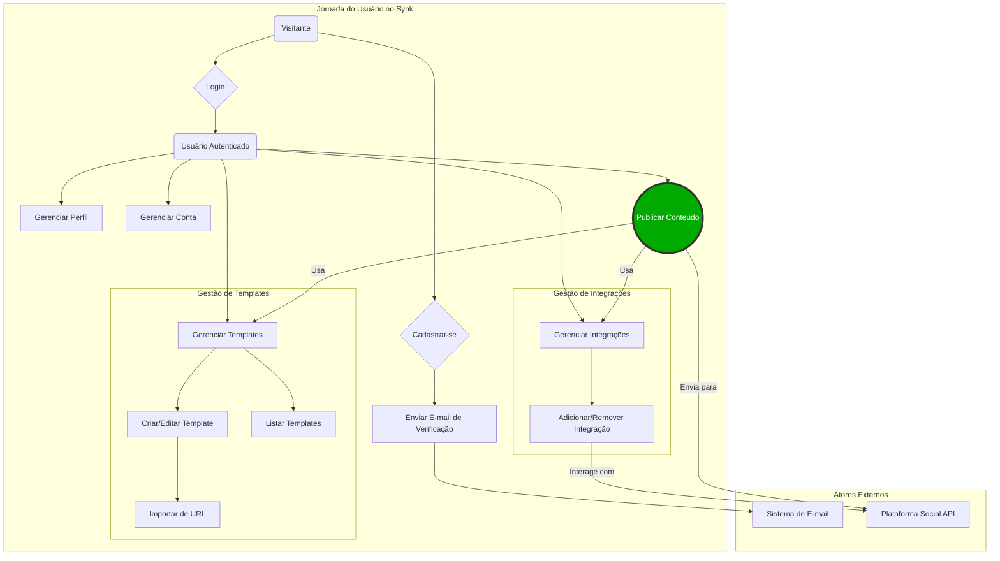
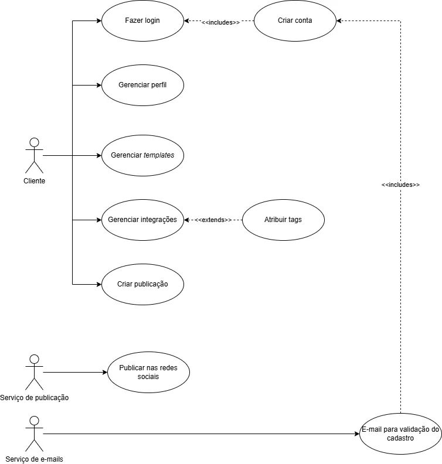
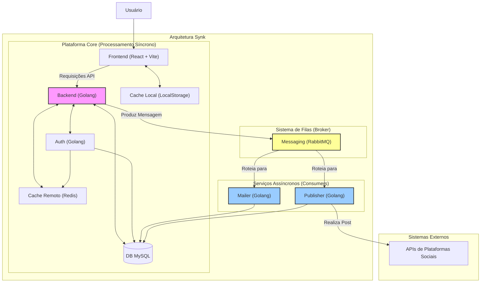
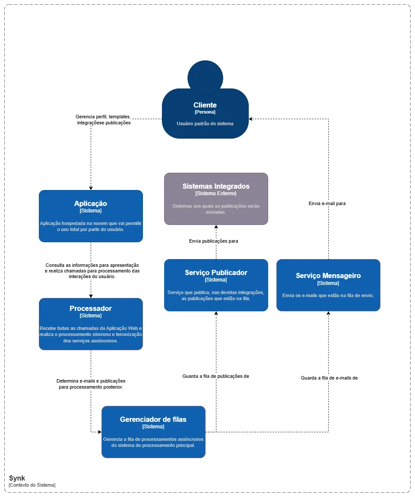
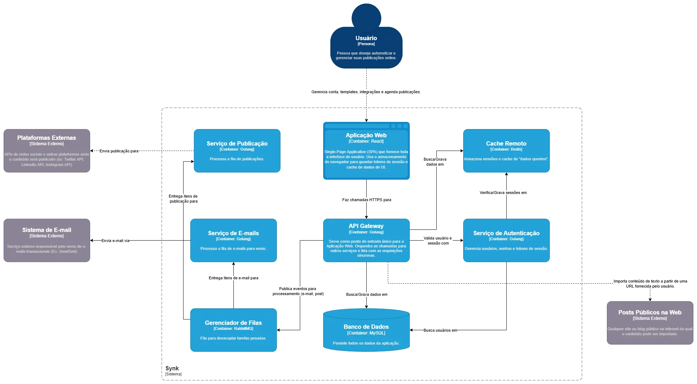
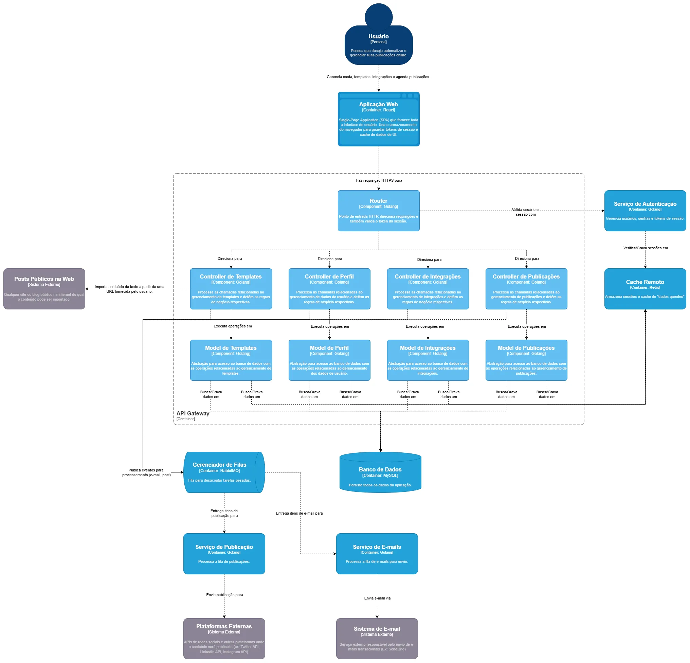

# Capa

- **Título do Projeto**: Synk, a melhor forma de padronizar seus anúncios e divulgações.
- **Nome do Estudante**: Cristian Prochnow.
- **Curso**: Engenharia de Software.
- **Data de Entrega**: ...

# Resumo

Gerenciar a comunicação em múltiplas plataformas sociais é uma tarefa repetitiva e demorada. Equipes de marketing perdem tempo postando manualmente em cada rede, enquanto times de desenvolvimento lutam para comunicar atualizações de forma ágil e consistente.

Synk surge como a solução para este desafio. Nossa plataforma centraliza e automatiza a publicação de conteúdo, permitindo que você economize tempo e mantenha a consistência da sua marca.

Através de um sistema intuitivo de **templates** e **integrações diretas** com as principais redes sociais, o Synk transforma um processo de vários passos em um único clique. Crie seus modelos de posts para diferentes contextos — seja um lançamento de produto, uma campanha de marketing ou uma nota de atualização — e publique simultaneamente onde seu público estiver.

É importante ressaltar: o Synk não é um CRM. Nosso foco é ser uma ferramenta especialista em agilidade, eliminando o esforço manual e repetitivo para que sua equipe possa se concentrar no que realmente importa: a estratégia e a criação de conteúdo de valor.

## 1. Introdução

No cenário digital atual, a presença constante e a interação ágil com o público são cruciais para o sucesso de qualquer empresa. No entanto, o processo para manter essa comunicação ativa — através de posts, anúncios e atualizações — é frequentemente manual, repetitivo e consome um tempo valioso das equipes.

O Synk foi criado para eliminar esse gargalo. Nossa plataforma ataca diretamente as tarefas que, embora pareçam triviais, são volumosas e desgastantes: a criação e publicação manual de conteúdo em diversas plataformas.

Nosso objetivo é simples: fornecer uma interface centralizada onde você pode criar e salvar templates para qualquer tipo de comunicado. Precisa anunciar uma atualização de produto no Slack e no Twitter? Preparar um post comercial para o LinkedIn? Com o Synk, você seleciona o modelo, faz ajustes rápidos e publica em todas as redes desejadas com poucos cliques.

É importante notar que o Synk não é um CRM. Nosso foco exclusivo é otimizar a base da sua produtividade, devolvendo o tempo que seria gasto em tarefas manuais para que sua equipe possa se concentrar em estratégia e crescimento.

## 2. Descrição do Projeto

O Synk é uma plataforma centralizadora projetada para otimizar a criação e publicação de conteúdo em múltiplas redes sociais e canais de comunicação. A ferramenta permite que usuários gerenciem uma biblioteca de templates, customizem textos de forma intuitiva e, após a configuração das integrações, publiquem em diversas plataformas com um único comando.

O projeto nasceu para resolver um desafio comum e frustrante: a necessidade de adaptar e postar manualmente o mesmo conteúdo em diferentes canais, um processo repetitivo que consome tempo e abre margem para inconsistências. O Synk elimina essa fricção ao permitir que templates sejam pré-configurados para contextos e redes específicas, unificando todo o fluxo de publicação.

É crucial entender nosso foco estratégico: diferente de plataformas de CRM que oferecem um leque amplo de funcionalidades, incluindo análise de métricas, o Synk se especializa na etapa de **execução**. Nosso objetivo é ser a melhor ferramenta para o trabalho prático de criar e distribuir conteúdo, atacando a tarefa que, embora muitas vezes considerada trivial, é a que mais consome tempo no dia a dia.

## 3. Especificação Técnica

### 3.1. Resumo

O sistema Synk é uma plataforma multiusuário (multi-tenant) para a criação, gerenciamento e publicação de conteúdo em redes sociais, baseada em um sistema de templates e integrações com APIs de terceiros.

### 3.2. Componentes Principais do Sistema

1. **Módulo de Usuários (Identity & Access Management)**
    - Responsável pelo cadastro, login (autenticação) e controle de permissões (autorização) dos usuários.
2. **Módulo de Templates**
    - Permite operações de CRUD (Criar, Ler, Atualizar, Excluir) para os templates de posts.
    - Cada template é estritamente vinculado ao usuário que o criou.
3. **Módulo de Integrações**
    - Gerencia as configurações e credenciais (tokens, chaves de API) para cada plataforma de destino (ex: LinkedIn, Twitter, Slack).
    - Deve garantir o armazenamento seguro das informações sensíveis.
4. **Módulo de Publicação (Publishing Engine)**
    - Utiliza um template e uma ou mais integrações ativas para realizar a postagem do conteúdo através das APIs correspondentes.
    - Responsável por tratar as respostas (sucesso/erro) de cada API.
5. **Módulo de Importação (Content Importer)**
    - Processa uma URL de um post público para extrair seu conteúdo e popular os campos de um novo template.
6. **Editor de Conteúdo (Rich Text Editor)**
    - Fornece uma interface de usuário (UI) do tipo WYSIWYG ("What You See Is What You Get") para que os usuários possam formatar o texto dos templates com estilos (negrito, itálico, listas, etc.).

### 3.3. Requisitos de Software

#### 3.3.1. Requisitos Funcionais

**Módulo 1: Gestão de Contas de Usuário (Account Management)**

- **RF-001:** O sistema deve permitir que um novo usuário se cadastre fornecendo Nome, E-mail e Senha.
- **RF-002:** Após o cadastro, o sistema deve disparar um e-mail de verificação para o endereço fornecido, contendo um link único para confirmação e ativação da conta.
- **RF-003:** O usuário autenticado deve poder editar seu nome de perfil.
- **RF-004:** O usuário autenticado deve poder alterar sua senha, sendo necessário fornecer a senha atual e a nova senha duas vezes para confirmação.
- **RF-005:** O usuário autenticado deve poder alterar sua foto de perfil.
- **RF-006:** O sistema deve validar o arquivo de foto de perfil no momento do upload, aceitando apenas os formatos `PNG`, `JPG` e `GIF` e limitando o tamanho a, no máximo, `2MB`.
- **RF-007:** O usuário deve poder inativar sua conta. Uma conta inativa não pode ser acessada, mas os dados são preservados.
- **RF-008:** O usuário deve poder solicitar a exclusão permanente de sua conta e de todos os dados associados, em conformidade com as leis de proteção de dados.

**Módulo 2: Gestão de Templates**

- **RF-009:** O usuário autenticado deve poder criar um novo template, fornecendo obrigatoriamente um `Nome` para o template e o `Conteúdo` do post.
- **RF-010:** Durante a criação de um template, o usuário deve poder importar o conteúdo de texto a partir de uma `URL` de um post público.
- **RF-011:** O sistema deve listar todos os templates criados pelo usuário.
- **RF-012:** O usuário deve poder editar o nome e o conteúdo de um template existente.
- **RF-013:** O usuário deve poder realizar uma exclusão lógica ("mover para a lixeira") de um template.
- **RF-014:** O usuário deve poder restaurar um template que está na lixeira para a lista de templates ativos.

**Módulo 3: Gestão de Integrações (Integration Management)**

- **RF-015:** O usuário deve poder adicionar uma nova integração, selecionando uma plataforma disponível (ex: Twitter, LinkedIn) e fornecendo as credenciais de acesso necessárias (via OAuth ou chave de API).
- **RF-016:** O usuário deve poder atribuir um nome/apelido personalizado para cada integração cadastrada (ex: "Meu Twitter Pessoal", "LinkedIn da Empresa").
- **RF-017:** O sistema deve listar todas as integrações configuradas pelo usuário, indicando a plataforma e o nome personalizado.
- **RF-018:** O usuário deve poder remover uma integração existente.
- **RF-019**: O usuário deve poder atribuir *tags* a uma integração existente, para organização desses registros

**Módulo 4: Fluxo de Publicação (Publishing Flow)**

- **RF-020:** Para iniciar uma publicação, o usuário deve selecionar um de seus templates existentes.
- **RF-021:** Na tela de publicação, o sistema deve permitir que o usuário edite livremente o conteúdo do post para aquela publicação específica, sem alterar o template original.
- **RF-022:** Na mesma tela, o usuário deve poder selecionar uma ou mais de suas integrações ativas como destino para a publicação.
- **RF-023:** Ao confirmar, o sistema deve enviar o conteúdo final para as APIs de cada uma das integrações de destino selecionadas.

#### 3.3.2. Requisitos Não-Funcionais

* **RNF-001:** A aplicação web deve ser totalmente funcional nas duas últimas versões estáveis dos principais navegadores: Google Chrome, Mozilla Firefox, Safari e Microsoft Edge.
* **RNF-002:** A interface deve ser responsiva e se adaptar para garantir uma boa experiência de uso em dispositivos móveis (smartphones), tablets e desktops.
* **RNF-003:** O tratamento de dados pessoais dos usuários deve estar em total conformidade com a Lei Geral de Proteção de Dados (LGPD) do Brasil.
* **RNF-004:** A forma como a Synk interage com as APIs de outras plataformas deve respeitar rigorosamente os Termos de Serviço e as políticas de uso de cada uma delas para evitar o bloqueio da aplicação.
* **RNF-005:** O prazo de envio à API das integrações será realizada de maneira assíncrona e deve ser até 1 hora após sua publicação dentro da plataforma.

#### 3.3.3. Fluxo

#### 3.3.4. Diagrama UML

### 3.4. Considerações de Design

#### 3.4.1. Visão inicial

A arquitetura está separada em apresentação e em processamento principal e paralelo. Cada um desses itens é separado em serviços distintos, que consomem o mesmo banco de dados. Importante ressaltar que não se trata de microsserviços, visto que a instância do banco de dados é compartilhado entre todos. Sendo assim, são apenas serviços separados para o acoplamento de responsabilidades.

#### 3.4.2. Arquitetura

- **Frontend** para interação direta com os usuários por meio da *web*, realizando a comunicação diretamente com o serviço de Backend. Esse serviço usa a instância local do cache do navegador ao qual está sendo usado.
- **Backend** fica responsável pelo processamento principal da aplicação. Ele fica responsável por receber todas as chamadas do Frontend. A autenticação é feita por meio do serviço de Auth, que fica responsável pela autenticação do usuário. Há também à disponilidade uma instância de cache com foco em performance, além da interação direta com a instância de banco de dados. Esse serviço envia as mensagens para o serviço de mensageria, que serve então outros dois serviços assíncronos.
- **Auth** é o serviço responsável por registrar o *login* dos usuários, interagindo tanto o banco de dados, como também com o serviço de cache para guardar a sessão.
- **Queuer** é o serviço de mensageria (Broker) que recebe as chamadas do Backend (*Producer*) e serve os serviços Mailer (*Consumer*) e Publisher (*Consumer*).
- **Mailer** recebe as mensagens do Queuer relacionadas ao envio assíncrono de e-mails que também interage com o banco de dados para busca de informações.
- **Publisher** recebe as mensagens do Queuer relacionadas à publicação dos posts por meio das integrações devidas, que também interage com o banco de dados para busca de informações.

#### 3.4.3. Modelagem C4

##### 3.4.3.1. Contexto do Sistema (C1)

##### 3.4.3.2. Contêineres (C2)

##### 3.4.3.3. Componentes (C3)

#### 3.4.4. Stack Tecnológica

Em nosso **Frontend**, será usado React para a construção da interface. Junto a isto, para a compilação do código TypeScript que será usado junto a essa lib, o Vite entrará em prática. Com isso, o uso do React será o mais puro possível, sem uso de qualquer *framework*. Com isso será possível ter uma ferramenta robusta e, ainda sim, leve e performática para interação com a interface.

Para o cache local de alguns dados, auxiliando a usabilidade do usuário no navegador, será usado o recurso nativo da plataforma que é o *Local Storage*. Com isso, será possível ter uma interface simples, mas ainda sim muito eficiente, para persistência de dados básicos e/ou extensos. E, para o cache de dados para o lado dos serviços externos, há um serviço em Redis rodando.

Para o banco de dados a ferramenta usada será o MySQL, ao qual é um banco de dados estabelecido e que possui muita documentação disponível. Além disso, com a nova versão do MySQL o uso se tornou ainda mais interessante pelo melhoramento da performance e outros recursos adicionados.

Para sistema de mensageria, a ferramenta será o RabbitMQ, devido à grande disponibilidade de documentação e a ser totalmente *open source*. Além disso, é uma tecnologia amplamente usada atualmente na indústria em diversas aplicações. Sendo assim, é um fundamento interessante para justificar o uso.

E, para os serviços distribuídos da aplicação, tanto os síncronos, como assíncronos, será usada a linguagem Golang, sem uso de qualquer framework. A ideia é que essa interação seja a mais pura possível, usando as ferramentas que a própria linguagem já possui embutida. Assim, o objetivo é usar *libs* apenas caso necessário para algum problema específico, ao qual as tecnologias nativas não possam ser adaptadas adequadamente ao uso em questão.

Já, para a infraestrutura de nuvem e o processo de _deploy_, a aplicação será hospedada em uma máquina virtual (VM) na **Google Cloud Platform (GCP)**. Essa escolha se dá pela flexibilidade e escalabilidade que o ambiente da GCP oferece. Todo o código-fonte será versionado e hospedado no **GitHub**, que servirá como nosso repositório central. Os processos de Integração Contínua (CI) e Entrega Contínua (CD) serão automatizados utilizando o **GitHub Actions**, garantindo que cada atualização no código seja testada e implantada de forma padronizada e segura diretamente na VM, otimizando o fluxo de desenvolvimento e entrega.

E, o gerenciamento do projeto, incluindo o planejamento de tarefas, acompanhamento de progresso e organização de _sprints_, será conduzido através do **GitHub Projects**. Essa ferramenta será integrada diretamente ao nosso repositório de código, o que facilitará a vinculação de _issues_, _pull requests_ e discussões às tarefas do projeto. Com isso, teremos uma visão clara e centralizada do andamento do desenvolvimento, promovendo a transparência e a colaboração entre a equipe de forma ágil e eficiente.

### 3.5. Considerações de Segurança

Análise de possíveis questões de segurança e como mitigá-las.

## 4. Próximos Passos

Descrição dos passos seguintes após a conclusão do documento, com uma visão geral do cronograma para Portfólio I e II.

## 5. Referências

- [React](https://react.dev/)
- [Vite](https://vite.dev/)
- [Golang](https://go.dev/)
- [Redis](https://redis.io/)
- [LocalStorage](https://developer.mozilla.org/en-US/docs/Web/API/Window/localStorage)
- [RabbitMQ](https://www.rabbitmq.com/)
- [MySQL](https://www.mysql.com/)

## 6. Apêndices (Opcionais)

Informações complementares, dados de suporte ou discussões detalhadas fora do corpo principal.
## 7. Avaliações de Professores

Adicionar três páginas no final do RFC para que os Professores escolhidos possam fazer suas considerações e assinatura:
- Considerações Professor/a:
- Considerações Professor/a:
- Considerações Professor/a:
